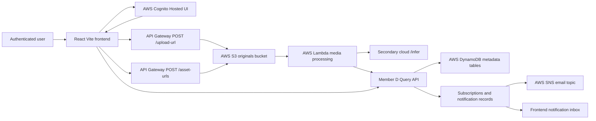

# Member E Architecture Notes

## UI Responsibilities

Member E owns the browser console and the user-facing integration across
Members A, B and D:

- Cognito Hosted UI sign-up, sign-in, sign-out and Google external login entry.
- Protected API calls with the Cognito ID token.
- Media upload through Member B's `POST /upload-url` and pre-signed S3 PUT.
- Private thumbnail and original access through Member B's authenticated
  `POST /asset-urls` and short-lived S3 GET URLs.
- Query, thumbnail lookup, by-file query, tag edit, delete, subscription and
  notification calls against Member D's API.
- Local build/test scripts and demo documentation.
- Optional SNS notification delivery through `NOTIFICATION_PUBLISHER=sns`.

## Runtime Diagram

## Report Contribution Text

Member E implemented the React frontend console, Cognito Hosted UI entry points,
authenticated API client, checksum-based upload workflow, private asset URL
resolution, query views, thumbnail-to-original lookup, file-based query form,
bulk tag editing, bulk deletion, subscription and notification inbox, signed
asset URL refresh/retry handling, local Node mocked contract/integration-flow tests (not browser E2E), CORS integration, and
user/demo documentation.
